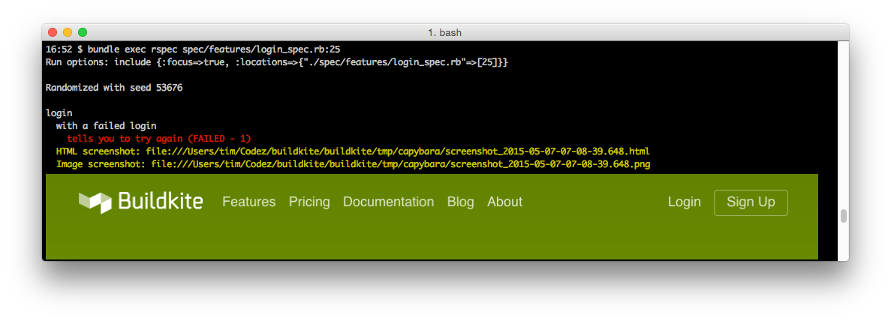
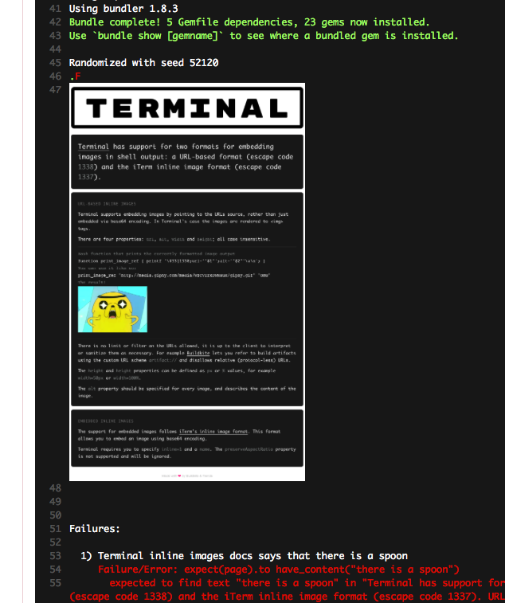

# capybara-inline-screenshot

Extends [capybara-screenshot](https://github.com/mattheworiordan/capybara-screenshot) with inline image output.

If `CI` environment variable is not present it will output screenshots in base64 encoded [iTerm2 image format](http://iterm2.com/images.html), and if `CI` is present it will output in the [Terminal artifact:// format](http://buildkite.github.io/terminal/inline-images/).

In [iTerm2 (nightly)](http://iterm2.com/):



In [Buildkite](https://buildkite.com/):



## Usage

Add it to your Gemfile (after `capybara-screenshot`):

```ruby
gem 'capybara-inline-screenshot'
```

And replace your call to:

```ruby
require 'capybara/screenshot/rspec'
```

with:

```ruby
require 'capybara-inline-screenshot/rspec'
```

## License

See the [LICENSE](LICENSE.md) file for license rights and limitations (MIT).
